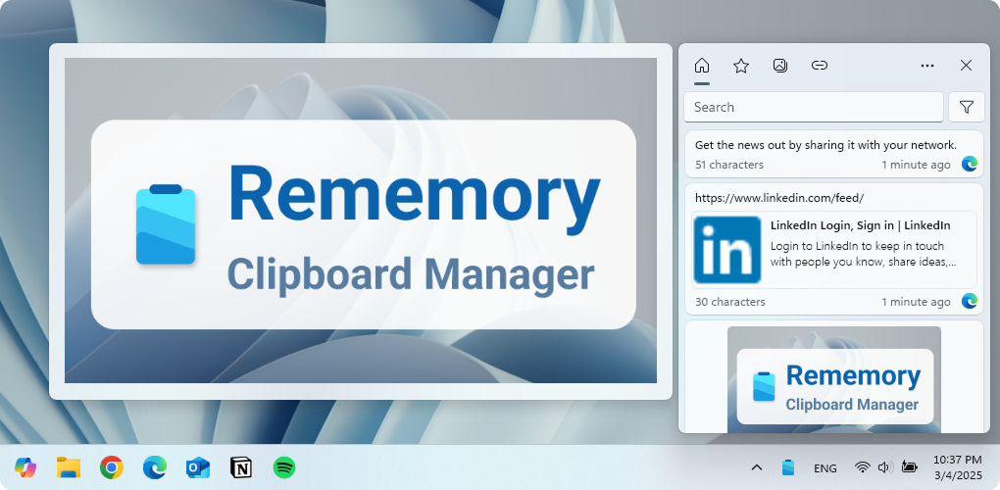
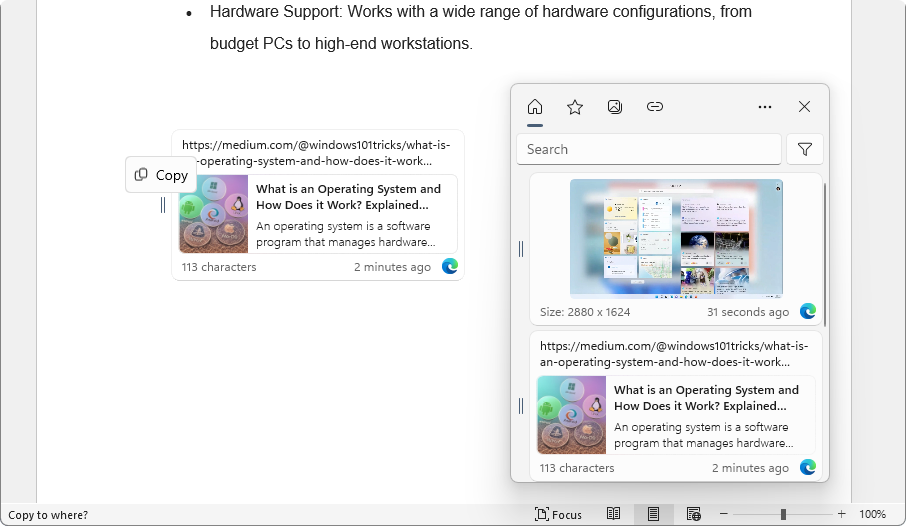
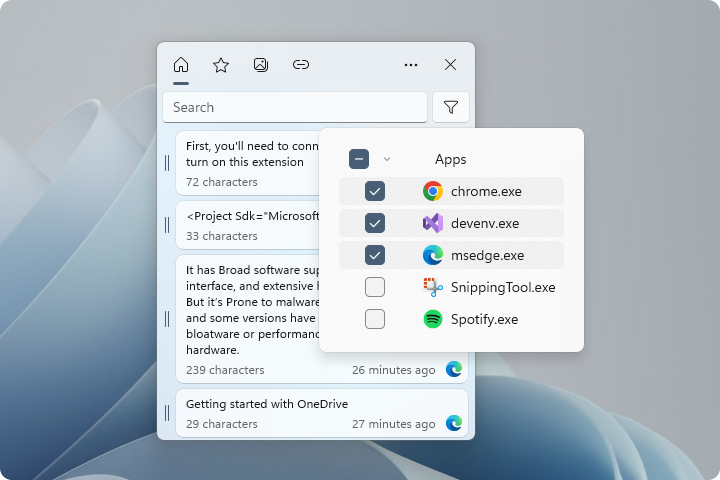
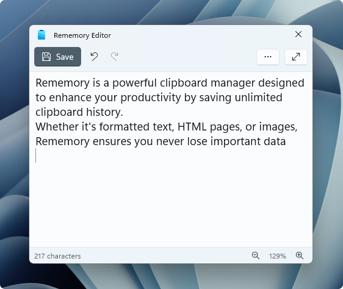
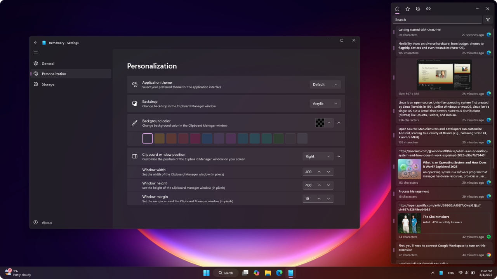

  

Rememory is a powerful clipboard manager that supercharges your productivity by saving everything you copy. Never lose track of important text, images, links, or even entire web pages again! Rememory keeps a complete history of your clipboard, organized and easily accessible.

With Rememory, you can quickly find what you need with powerful search and filtering, edit copied content on the fly, and even drag and drop items into other applications. Enjoy features like app filtering to control which applications are tracked, organized data grouping, and handy link and data previews. For the best experience, run Rememory as an administrator to take advantage of all its features.

Rememory puts you in control of your clipboard and helps you work more efficiently.
Get Rememory today and never lose track of copied information again!

## Features

- Unlimited clipboard history storage
- Save various data types: formatted text, images, HTML
- Quick search with filtering
- Organized data grouping
- Drag and Drop (doesn't work if run as administrator, see [issue](https://github.com/hpavlo/Rememory/issues/2))
- Window pinning
- Edit clipboard content
- Owner app filters

## Download

[Privace Policy](./PRIVACY.md)

## Translation

[Translate the project on Crowdin](https://crowdin.com/project/rememory)

## Screenshots
### Drag and Drop

You can easily move items from your clipboard history into other apps. The image shows how to drag link from Rememory to text editor.

  

### Search with filters

Find exactly what you need! Use app filters to quickly find any copied item.

  

### Text editor

Need to make a quick change? Edit your copied text right inside Rememory before you paste it.

  

### Personalisation

Make Rememory your own!  Change the background, colors, and window size to fit your style.

  

